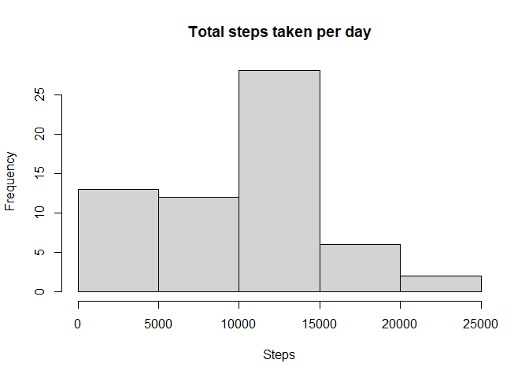
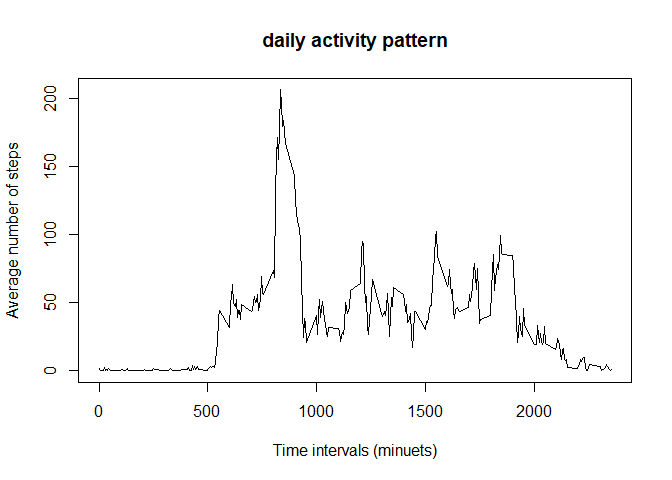
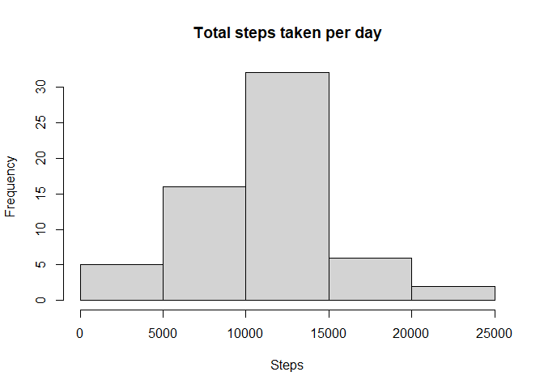
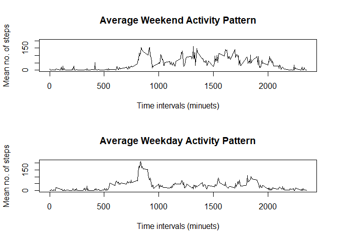

## Loading and preprocessing the data

First we load the data.

```r
df <- read.csv("activity.csv")
```

Then format the dates.

```r
df$date <- as.Date(df$date)
```

## What is mean total number of steps taken per day?

Calculate the total number of steps taken per day ignoring misssing data. 

```r
total_steps <- tapply(df$steps,df$date,sum,na.rm=T)
hist(total_steps,main="Total steps taken per day",xlab = "Steps")
```

<!-- -->

Here is the mean and median of the total steps per day.

```r
mean(total_steps)
```

```
## [1] 9354.23
```

```r
median(total_steps)
```

```
## [1] 10395
```

## What is the average daily activity pattern?

Visualization of daily activity.  

```r
ave_steps<- tapply(df$steps,df$interval,mean,na.rm=T)
plot(names(ave_steps),ave_steps,type="l",main="daily activity pattern",xlab="Time intervals (minuets)",ylab="Average number of steps")
```

<!-- -->

The interval containing the maximum average number of steps.

```r
names(ave_steps)[which(ave_steps==max(ave_steps))]
```

```
## [1] "835"
```

## Imputing missing values

Missing values in our data. 

```r
colSums(sapply(df,is.na))
```

```
##    steps     date interval 
##     2304        0        0
```

Now we impute the missing data in Steps col. I will use the hotdeck function from the VIM package. 
This preforms Hotdeck imputation on the data frame.

```r
library(VIM)
```

```
## Loading required package: colorspace
```

```
## Loading required package: grid
```

```
## VIM is ready to use.
```

```
## Suggestions and bug-reports can be submitted at: https://github.com/statistikat/VIM/issues
```

```
## 
## Attaching package: 'VIM'
```

```
## The following object is masked from 'package:datasets':
## 
##     sleep
```

```r
set.seed(1)
df_imputed <- hotdeck(df)
head(df_imputed)
```

```
##   steps       date interval steps_imp date_imp interval_imp
## 1     0 2012-10-01        0      TRUE    FALSE        FALSE
## 2     0 2012-10-01        5      TRUE    FALSE        FALSE
## 3     0 2012-10-01       10      TRUE    FALSE        FALSE
## 4   281 2012-10-01       15      TRUE    FALSE        FALSE
## 5    42 2012-10-01       20      TRUE    FALSE        FALSE
## 6     0 2012-10-01       25      TRUE    FALSE        FALSE
```

As you can see the missing values from steps have been imputed.
Now we calculate and plot the total steps for each day as before, but this time with the imputed data.


```r
total_steps <- tapply(df_imputed$steps,df_imputed$date,sum)
hist(total_steps,main="Total steps taken per day",xlab = "Steps")
```

<!-- -->

Here is the mean and median of the total steps per day.

```r
mean(total_steps)
```

```
## [1] 10623.82
```

```r
median(total_steps)
```

```
## [1] 10600
```

The impact of imputing the data is that the mean and the median have both increased.

## Are there differences in activity patterns between weekdays and weekends?

Create a factor vairable to indicate which days are weekends and weekdays


```r
weekdays1 <- c('Monday', 'Tuesday', 'Wednesday', 'Thursday', 'Friday')
df_imputed$wDay <- factor((weekdays(df_imputed$date) %in% weekdays1), levels=c(FALSE, TRUE), labels=c('weekend', 'weekday'))
head(df_imputed)
```

```
##   steps       date interval steps_imp date_imp interval_imp    wDay
## 1     0 2012-10-01        0      TRUE    FALSE        FALSE weekday
## 2     0 2012-10-01        5      TRUE    FALSE        FALSE weekday
## 3     0 2012-10-01       10      TRUE    FALSE        FALSE weekday
## 4   281 2012-10-01       15      TRUE    FALSE        FALSE weekday
## 5    42 2012-10-01       20      TRUE    FALSE        FALSE weekday
## 6     0 2012-10-01       25      TRUE    FALSE        FALSE weekday
```

Finally we compare the average activity patterns of weekdays and weekends. 


```r
splitDf <- split(df_imputed,df_imputed$wDay)
weekend <- tapply(splitDf[[1]]$steps,splitDf[[1]]$interval,mean)
weekday <- tapply(splitDf[[2]]$steps,splitDf[[2]]$interval,mean)
par(mfrow=c(2,1))
plot(names(weekend),weekend,type="l",ylim=c(0,200),ylab="Mean no. of steps",xlab="Time intervals (minuets)",main="Average Weekend Activity Pattern")
plot(names(weekday),weekday,type="l",ylab="Mean no. of steps",xlab="Time intervals (minuets)",main="Average Weekday Activity Pattern")
```

<!-- -->

